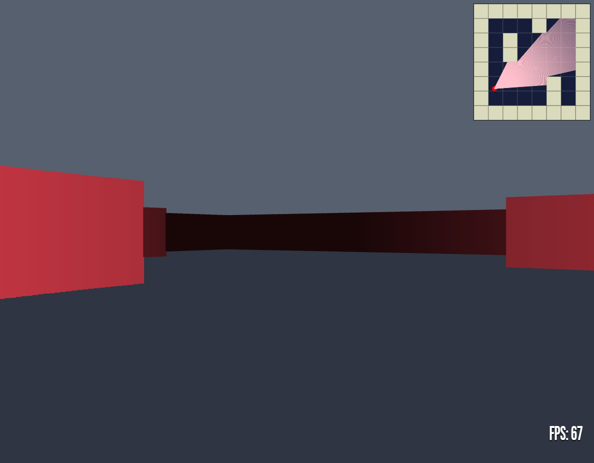

# JS Raytracer
A [Wolfenstein 3D](https://en.wikipedia.org/wiki/Wolfenstein_3D) inspired [raytracer](https://en.wikipedia.org/wiki/Ray_casting#Ray_casting_in_early_computer_games).

	 
	

## Stack
| Name | Description |
| -- | -- |
| Typescript / Tsify | For type-safe coding, compiles to JS |
| Babel / Babelify | For cross-browser compatibility, compiles JS into retro-compatible JS |
| Eslint | For linting and semantic analysis |
| Browserify | For bundling JS files |
| Sass | Superset of CSS |
| Gulp | For building tooling |
| Pure HTML5 Canvas API | For graphics |

## Building sources

- `yarn install` to install dependencies
- `yarn build` to build sources
- Open the `index.html` file at `/dist/index.html`

For dev environment, you can use `yarn dev` to run the server and live reload on changes.